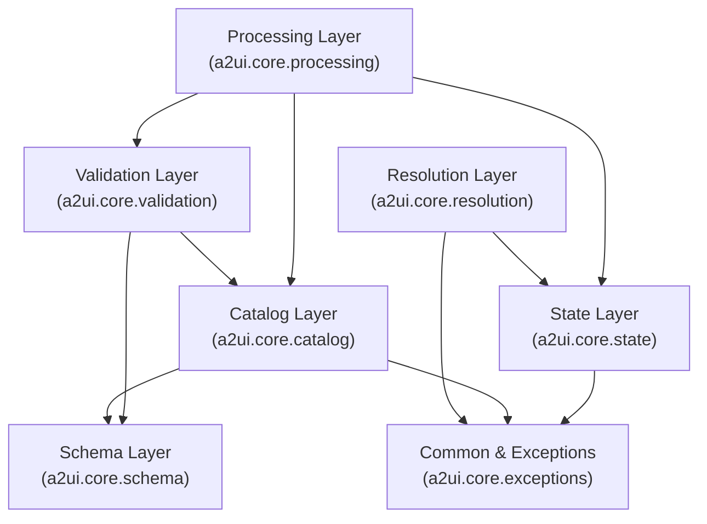
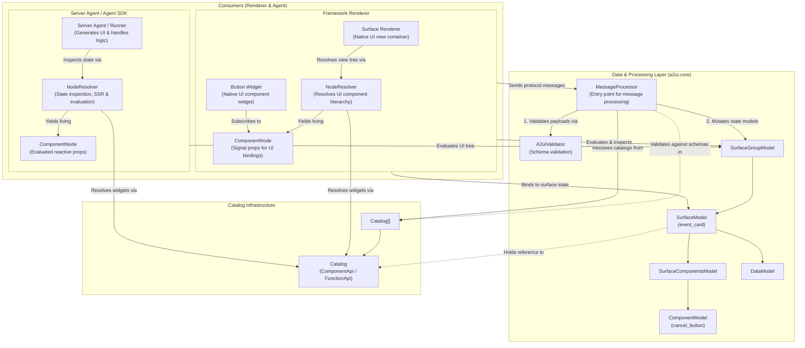

# A2UI Core SDK Specification

This document describes the detailed programmatic specification and architecture of the A2UI Core SDK. The Core SDK serves as the foundational data, state, and processing layer of A2UI.

This layer handles JSON parsing, state models, JSON pointers, catalogs, and schemas. This logic remains completely framework-agnostic, allowing it to be implemented identically across all target environments (including agent-side or headless languages where there is no renderer).

For a high-level overview of the entire A2UI ecosystem (including the Inference SDK and Framework Adapter structure), see the [A2UI Unified SDK Architecture](../../specification/v0_9_1/docs/sdks_spec.md). For UI framework integration and rendering details, see the [A2UI Framework Adapter Blueprint](a2ui_framework_adapter.blueprint.md).

---

## 1. Core SDK Role & Architecture

The A2UI Core SDK acts as the central state coordinator. It is designed to represent core concepts and behaviors described in the A2UI specification, without any UI rendering logic.

Its core responsibilities include:

1. **Catalog Representation:** Define `Catalog` structures and pure technical component metadata/schemas (`ComponentApi`, `FunctionApi`).
2. **Protocol Definitions:** Model strongly-typed inbound and outbound message structures (e.g., `RendererToAgent`, `AgentToRenderer`, etc.).
3. **Surface State Containers:** Track mutable, long-lived rendering states via `SurfaceModel`, `ComponentModel`, and `DataModel`.
4. **Message Processor:** Parse inbound message sequences to mutate local state containers via `MessageProcessor`.
5. **JSON Pointer Scope:** Standardize relative pointer evaluation and reactivity via scoped context managers.
6. **Validation:** Performs structural JSON Schema checks, reference checks, loop/recursion analysis, and layout integrity checks.
7. **Resolution:** Resolves bound context paths and binds state variables to components for local evaluation.
8. **Multi-Version Protocol Branching:** Support multi-version schema and basic catalog dispatching (`v0_8`, `v0_9`, `v0_9_1`, `v1_0`).

---

### A. High-Level Layer Architecture



### B. Runtime Object Architecture & Consumer Binding

The diagram below illustrates how consumers (both Framework Renderers and Server Agents / Agent SDKs) interact with `MessageProcessor` and inspect the reactive layout state:



---

## 2. Directory & Package Structure

The core modular components are organized within the `a2ui.core` namespace. Public interfaces are exposed cleanly across the package layers:

```
python/a2ui_core/src/a2ui/core/
├── exceptions.ts                      # Root exception hierarchy
├── basic_catalog/                     # Bundled default components and operators
│   ├── v0_8/                          # Conforms to spec v0.8
│   │   └── basic_catalog.json
│   ├── v0_9/                          # Conforms to spec v0.9 / v0.9.1
│   │   └── basic_catalog.json
│   └── v1_0/                          # Conforms to spec v1.0
│       └── basic_catalog.json
├── catalog/                           # Catalog declarations
│   ├── catalog.ts                     # Catalog base class
│   ├── components.ts                  # Component declarations
│   └── functions.ts                   # Function declarations
├── state/                             # Reactive Layout State Models
│   ├── component_model.ts             # Component property structures
│   ├── data_model.ts                  # Value dictionary binding paths
│   ├── surface_model.ts               # Single UI surface container
│   ├── surface_components_model.ts    # Inlined graph topology & integrity checks
│   └── surface_group_model.ts         # Collection of active surfaces
├── processing/                        # Mutation processing engine
│   ├── message_processor.ts           # Single MessageProcessor entrypoint
│   └── adapters/                      # Spec Version Adapters
│       ├── base.ts                    # VersionAdapter interface
│       ├── registry.ts                # ProtocolVersionRegistry
│       ├── v0_8.ts                    # v0.8 adapter
│       ├── v0_9.ts                    # v0.9 adapter
│       └── v1_0.ts                    # v1.0 adapter
├── validation/                        # Layout validation layer
│   ├── validator.ts                   # Core A2uiValidator class
│   └── catalog_schema_validator.ts    # JSON schema catalog validator
├── resolution/                        # View Tree Resolution & Rendering Engine
│   ├── component_node.ts              # Living node in view hierarchy (Signal props)
│   ├── node_graph.ts                  # Reactive node graph traversal engine
│   └── data_context.ts                # Path binding & function evaluator (Internal)
└── schema/                            # Autogenerated protocol Zod models
    ├── v0_8/                          # Models for spec v0.8
    │   ├── common_types.ts
    │   ├── agent_to_renderer.ts
    │   ├── renderer_to_agent.ts
    │   └── renderer_capabilities.ts
    ├── v0_9/                          # Models for spec v0.9
    │   ├── common_types.ts
    │   ├── agent_to_renderer.ts
    │   ├── renderer_to_agent.ts
    │   └── renderer_capabilities.ts
    └── v1_0/                          # Models for spec v1.0
        ├── common_types.ts
        ├── agent_to_renderer.ts
        ├── renderer_to_agent.ts
        └── renderer_capabilities.ts
```

---

## 3. Interface Specification

### A. Catalog Layer (`a2ui.core.catalog`)

#### `Catalog`

A catalog groups component definitions and function definitions together, along with an optional theme schema.

> [!NOTE]
> **Catalog Identifiers (`id` / `catalogId`)**: A catalog's `id` is a string identifier, not a resolvable URI. While it is conventionally formatted as a URI (e.g., `https://mycompany.com/1.0/somecatalog`) to prevent naming collisions across organizations, it does not need to point to any deployed resource or downloadable file. Renderer and agent developers must agree on shared catalogs with well-known IDs in order to build systems that are compatible with each other.

```typescript
export interface Catalog<TComponent extends ComponentApi, TFunction extends FunctionApi> {
  readonly id: string;
  readonly specVersion: string;
  readonly components: ReadonlyMap<string, TComponent>;
  readonly functions?: ReadonlyMap<string, TFunction>;
  readonly themeSchema?: Record<string, any>;
}
```

#### `ComponentApi`

The framework-agnostic definition of a component. It defines the name and the exact JSON schema footprint of the component, without any rendering logic. It acts as the single source of truth for the component's contract.

```typescript
interface ComponentApi {
  /** The name of the component as it appears in the A2UI JSON (e.g., 'Button'). */
  readonly name: string;
  /** The technical definition used for validation and generating renderer capabilities. */
  readonly schema: Schema;
}
```

#### `FunctionApi` & `FunctionImplementation`

Stateless definition representing a catalog function signature and executable business logic.

```typescript
interface FunctionApi {
  readonly name: string;
  readonly returnType: 'string' | 'number' | 'boolean' | 'array' | 'object' | 'any' | 'void';
  readonly schema: Schema; // The expected arguments
}

/**
 * A function implementation. Splitting API from Implementation is less critical than
 * for components because functions are framework-agnostic, but it allows for
 * re-using API definitions across different implementation providers.
 */
interface FunctionImplementation extends FunctionApi {
  // Executes the function logic. Accepts static inputs, returns a value or a reactive stream.
  execute(args: Record<string, any>, context: DataContext): unknown | Observable<unknown>;
}

class Catalog<T extends ComponentApi> {
  readonly id: string; // Unique catalog ID (string identifier)
  readonly components: ReadonlyMap<string, T>;
  readonly functions?: ReadonlyMap<string, FunctionImplementation>;
  readonly themeSchema?: Schema;

  constructor(
    id: string,
    components: T[],
    functions?: FunctionImplementation[],
    themeSchema?: Schema,
  ) {
    // Initializes the properties
  }
}
```

**Function Implementation Details**:
Functions in A2UI accept statically resolved values as input arguments (not observable streams). However, they can return an observable stream (or Signal) to provide reactive updates to the UI, or they can simply return a static value synchronously.

Functions generally fall into a few common patterns:

1.  **Pure Logic (Synchronous)**: Functions like `add` or `concat`. Their logic is immediate and depends only on their inputs. They typically return a static value.
2.  **External State (Reactive)**: Functions like `clock()` or `networkStatus()`. These return long-lived streams that push updates to the UI independently of data model changes.
3.  **Effect Functions**: Side-effect handlers (e.g., `openUrl`, `closeModal`) that return `void`. These are triggered by user actions rather than interpolation.

If a function returns a reactive stream, it MUST use an idiomatic listening mechanism that supports standard unsubscription. To properly support an AI agent, functions SHOULD include a schema to generate accurate renderer capabilities.

#### The Basic Catalog Standard (Core APIs)

The standard A2UI Basic Catalog specifies a set of core components (Button, Text, Row, Column) and functions.

##### Strict API / Implementation Separation

When building libraries that provide the Basic Catalog, it is **crucial** to separate the pure API (the Schemas and `ComponentApi`/`FunctionApi` definitions) from the actual UI implementations.

- **Multi-Framework Code Reuse**: In ecosystems like the Web, this allows a shared `web_core` library to define the Basic Catalog API and Binders once, while separate packages (`react_renderer`, `angular_renderer`) provide the native view implementations.
- **Developer Overrides**: By exposing the standard API definitions, developers adopting A2UI can easily swap in custom UI implementations (e.g., replacing the default `Button` with their company's internal Design System `Button`) without having to rewrite the complex A2UI validation, data binding, and capability generation logic.

For a detailed walkthrough on how to visually and functionally implement each basic component and function, refer to the [Basic Catalog Implementation Guide](../../specification/v0_9_1/docs/basic_catalog_implementation_guide.md).

##### Strongly-Typed Catalog Implementations

To ensure all components are properly implemented and match the exact API signature, platforms with strong type systems should utilize their advanced typing features. This ensures that a provided renderer not only exists, but its `name` and `schema` strictly match the official Catalog Definition, catching mismatches at compile time rather than runtime.

###### Statically Typed Languages (e.g. Kotlin/Swift)

In languages like Kotlin, you can define a strict interface or class that demands concrete instances of the specific component APIs defined by the Core Library.

```kotlin
// The Core Library defines the exact shape of the catalog
class BasicCatalogImplementations(
    val button: ButtonApi, // Must be an instance of the ButtonApi class
    val text: TextApi,
    val row: RowApi
    // ...
)
```

###### Dynamic Languages (e.g. TypeScript)

In TypeScript, we can use intersection types to force the framework renderer to intersect with the exact definition.

```typescript
// Concept: Forcing implementations to match the spec
type BasicCatalogImplementations = {
  Button: ComponentImplementation & {name: 'Button'; schema: Schema};
  Text: ComponentImplementation & {name: 'Text'; schema: Schema};
  Row: ComponentImplementation & {name: 'Row'; schema: Schema};
  // ...
};
```

##### Expression Resolution Logic (`formatString`)

The Basic Catalog requires a `formatString` function capable of interpreting `${expression}` syntax within string properties.

**Implementation Requirements**:

1.  **Recursion**: The implementation MUST use `DataContext.resolveDynamicValue()` or `DataContext.subscribeDynamicValue()` to recursively evaluate nested expressions or function calls (e.g., `${formatDate(value:${/date})}`).
2.  **Tokenization**: Distinguish between DataPaths (e.g., `${/user/name}`) and FunctionCalls (e.g., `${now()}`).
3.  **Escaping**: Literal `${` sequences must be handled (typically escaping as `\${`).
4.  **Reactive Coercion**: Results are transformed into strings using the standard Type Coercion rules.

#### Composing Your Own Catalog

You can define your own catalog by composing components and functions that reflect your design system. While you can build a catalog entirely from scratch, you can also import or combine definitions with the Basic Catalog to save time.

_Example of composing a catalog:_

```python
# Pseudocode
myCustomCatalog = Catalog(
  id="https://mycompany.com/catalogs/custom_catalog.json",
  functions=basicCatalog.functions,
  components=basicCatalog.components + [MyCompanyLogoComponent()],
  themeSchema=basicCatalog.themeSchema # Inherit theme schema
)
```

---

### B. Processing Layer (`a2ui.core.processing`)

#### `MessageProcessor`

The "Controller" that accepts the raw stream of A2UI messages, parses them, and mutates the Models. It also handles the aggregation of renderer state for synchronization.

```typescript
class MessageProcessor<T extends ComponentApi> {
  readonly model: SurfaceGroupModel<T>;

  constructor(catalogs: Catalog<T>[], actionHandler: ActionListener);

  // Accepts validated, strongly-typed message objects, not raw JSON
  processMessages(messages: AgentToRendererMessage[]): void;
  addLifecycleListener(l: SurfaceLifecycleListener<T>): () => void;

  // Returns a strictly typed capabilities object ready for JSON serialization
  getRendererCapabilities(options?: CapabilitiesOptions): A2uiRendererCapabilities;

  /**
   * Returns the aggregated data model for all surfaces that have 'sendDataModel' enabled.
   * This should be used by the transport layer to populate metadata (e.g., 'A2uiRendererDataModel').
   */
  getRendererDataModel(): A2uiRendererDataModel | undefined;
}
```

#### Renderer Data Model Synchronization

When a surface is created with `sendDataModel: true`, the renderer is responsible for sending the current state of that surface's data model back to the agent whenever a renderer-to-agent message (like an `action`) is sent.

**Implementation Flow:**

1.  The `MessageProcessor` tracks the `sendDataModel` flag for each surface.
2.  The `getRendererDataModel()` method iterates over all active surfaces and returns a map of data models for those where the flag is enabled.
3.  The **Transport Layer** (e.g., A2A, MCP) calls `getRendererDataModel()` before sending any message to the agent.
4.  If a non-empty data model map is returned, it is included in the transport's metadata field (e.g., `A2uiRendererDataModel` in A2A metadata).

- **Surface Lifecycle**: It is an error to receive a `createSurface` message for a `surfaceId` that is already active; `surfaceId` must be globally unique per client session. The processor MUST throw an error or report a validation failure if this occurs.
- **Component Lifecycle**: If an `updateComponents` message provides an existing `id` but a _different_ `type`, the processor MUST remove the old component and create a fresh one to ensure framework renderers correctly reset their internal state.

#### Generating Renderer Capabilities and Schema Types

To dynamically generate the `A2uiRendererCapabilities` payload (specifically `inlineCatalogs`), the processor must convert internal component schemas into valid JSON Schemas.

**Schema Types Location**: Foundational schema types _should_ be defined in a dedicated directory like `schema`. You can see the `renderers/web_core/src/v1_0/schema/common-types.ts` file in the reference web implementation as an example.

**Detectable Common Types**: Shared definitions (like `DynamicString`) must emit external JSON Schema `$ref` pointers. This is achieved by "tagging" the schemas using their `description` property (e.g., `REF:common_types.json#/$defs/DynamicString`).

When `getRendererCapabilities()` converts internal schemas to generate `inlineCatalogs`:

1. Components: Translate each component schema into a raw JSON Schema. Wrap it in the standard A2UI component envelope (`allOf` containing `ComponentCommon`).
2. Functions: Map each function in the catalog to a `FunctionDefinition` object, converting its argument schema to JSON Schema.
3. Theme: Convert the catalog's theme schema into a JSON Schema representation.
4. Reference Processing: For all generated schemas (components, functions, and themes), traverse the tree looking for descriptions starting with `REF:`. Strip the tag and replace the node with a valid JSON Schema `$ref` object.

#### Version Adapters (`a2ui.core.processing.adapters`)

Private Version Adapters decouple version-specific syntax differences from `MessageProcessor`:

```typescript
export interface VersionAdapter {
  readonly version: string;
  /** Extracts 'theme' (v0.8/v0.9) or 'surfaceProperties' (v1.0+) from createSurface payload. */
  extractSurfaceProperties(payload: Record<string, any>): Record<string, any>;
}

export interface ProtocolVersionRegistry {
  getAdapter(version: string): VersionAdapter;
  /** Register custom or future version adapters (e.g. v2.0). */
  registerAdapter(adapter: VersionAdapter): void;
}
```

#### Renderer vs. Agent Execution Patterns

`MessageProcessor` serves as the single unified entry point across both environments, configured via constructor options:

```typescript
// 1. Client-Side Renderer Usage (Multi-catalog, UI action handler provided)
const rendererProcessor = new MessageProcessor({
  catalogs: [basicCatalog, customCatalog1, customCatalog2],
  actionHandler: handleRendererClickEvents, // Routes UI events (clicks, form submits) to client app
});
rendererProcessor.processMessages(incomingMessagesFromAgent);

// 2. Server-Side Agent Usage (Single negotiated catalog, actionHandler omitted / undefined)
const agentProcessor = new MessageProcessor({
  catalogs: [negotiatedCatalog], // Single negotiated catalog enforces catalog compliance
  actionHandler: undefined, // Agent does not render DOM elements or handle clicks
});
agentProcessor.processMessages(generatedLlmPayloadMessages);
```

| Execution Aspect              | Client-Side Renderer                                                                                              | Server-Side Agent                                                           |
| :---------------------------- | :---------------------------------------------------------------------------------------------------------------- | :-------------------------------------------------------------------------- |
| **`catalogs` Parameter**      | Passes all renderer-supported catalogs (`catalogs: [catA, catB]`).                                                | Passes single negotiated catalog (`catalogs: [negotiatedCatalog]`).         |
| **`actionHandler` Parameter** | UI event callback (`actionHandler: onUiEvent`).                                                                   | Omitted or `undefined` (`actionHandler: undefined`).                        |
| **Catalog Compliance**        | Matches `createSurface.catalogId` and component/function `catalogId` overrides against renderer's supported list. | Fails if LLM generates payload referencing un-negotiated catalog.           |
| **Primary Goal**              | Mutates live DOM view models and routes user clicks.                                                              | Pre-flight payload validation & state tree health verification before send. |

---

### C. Validation Layer (`a2ui.core.validation`)

#### `ValidationConfig` & `A2uiValidator`

```typescript
export interface ValidationConfig {
  allowOrphanComponents?: boolean;
  allowDanglingReferences?: boolean;
  allowMissingRoot?: boolean;
  allowedMessages?: string[];
}

/** Stateless validator executing envelope structure, component property schema, theme schema, and path syntax checks. */
export class A2uiValidator {
  constructor(catalogs: Catalog<any, any>[], validationConfig?: ValidationConfig);

  /** Single public entry point: performs catalog property schema validation. */
  validate(messages: unknown[]): void;

  /** Internal: Validates component properties against catalog JSON schemas. */
  protected validateComponents(components: ComponentApi[]): void;

  /** Internal: Validates theme / surfaceProperties against catalog theme schema. */
  protected validateSurfaceProperties(surfaceProperties: Record<string, any>): void;

  /** Internal: Verifies JSON Pointer path syntax in data model updates and dynamic bindings. */
  protected validatePathSyntax(messages: unknown[]): void;
}
```

#### Validation Implementation Matrix

The matrix below details the specific validation checks and their responsible component/method in `a2ui_core`:

| Validation Category      | Specific Validation Check                                                                         | Responsible Component / Implementation                                    |
| :----------------------- | :------------------------------------------------------------------------------------------------ | :------------------------------------------------------------------------ |
| **Protocol Envelope**    | Single update type per message (`createSurface`, `updateComponents`, etc.)                        | `A2uiValidator` (Zod envelope schema)                                     |
| **Protocol Envelope**    | Valid `version` tag (`v0.8`, `v0.9`, `v1.0`) & required envelope keys                             | `A2uiValidator` (Zod envelope schema)                                     |
| **Surface Lifecycle**    | Surface non-existence on `createSurface` (no duplicates)                                          | `MessageProcessor.processCreateSurface()` (`SurfaceGroupModel`)           |
| **Surface Lifecycle**    | Surface existence on `updateComponents`, `updateDataModel`, `deleteSurface`                       | `MessageProcessor.processUpdateComponents()` / `processUpdateDataModel()` |
| **Catalog Negotiation**  | `createSurface.catalogId` and component/function `catalogId` match negotiated renderer capability | `new MessageProcessor({ catalogs: [negotiatedCatalog] })`                 |
| **Catalog Resolution**   | `createSurface.catalogId` and component/function `catalogId` exist in supported catalogs list     | `MessageProcessor.processCreateSurface()`                                 |
| **Component Keys**       | Required `id` and `component` (type name) on creation                                             | `A2uiValidator` (Zod envelope schema)                                     |
| **Component Properties** | Property schema validation against catalog definition                                             | `A2uiValidator(CatalogSchemaValidator.validateComponents())`              |
| **Theme / Properties**   | `Theme` / `surfaceProperties` validation against catalog schema                                   | `A2uiValidator(CatalogSchemaValidator.validateSurfaceProperties())`       |
| **Graph Integrity**      | Duplicate component IDs within surface                                                            | `SurfaceComponentsModel.upsertComponent()`                                |
| **Graph Integrity**      | Missing root component (`id="root"`)                                                              | `SurfaceComponentsModel.validateSurfaceCompleteness()`                    |
| **Graph Integrity**      | Dangling component references (pointers to missing IDs)                                           | `SurfaceComponentsModel.validateSurfaceCompleteness()`                    |
| **Graph Topology**       | Self-reference detection (`comp_id == ref_id`)                                                    | `SurfaceComponentsModel.upsertComponent()`                                |
| **Graph Topology**       | Circular reference / cycle detection (DFS stack)                                                  | `SurfaceComponentsModel.detectCycles()`                                   |
| **Graph Topology**       | Unreachable / orphan component detection                                                          | `SurfaceComponentsModel.validateSurfaceCompleteness()`                    |
| **Depth & Syntax**       | Global recursion depth limit (>50) & function nesting (>5)                                        | `SurfaceComponentsModel.detectCycles()`                                   |
| **Depth & Syntax**       | JSON Pointer path syntax validation                                                               | `A2uiValidator.validatePathSyntax()`                                      |

---

### D. The Framework-Agnostic Data Layer

The Data Layer maintains a long-lived, mutable state object. This layer follows the exact same design in all programming languages and **does not require design work when porting to a new framework**.

#### Prerequisites

To implement the Data Layer effectively, your target environment needs two foundational utilities:

##### 1. Schema Library

To represent and validate component and function APIs, the Data Layer requires a **Schema Library** (like **Zod** in TypeScript or **Pydantic** in Python) that allows for programmatic definition of schemas and the ability to export them to standard JSON Schema. If no suitable library exists, raw JSON Schema strings or `Codable` structs can be used.

##### 2. Observable Library

A2UI relies on standard observer patterns. The Data Layer needs two types of reactivity:

- **Event Streams**: Simple publish/subscribe mechanisms for discrete events (e.g., `onSurfaceCreated`, `onAction`).
- **Stateful Streams (Signals)**: Reactive variables that hold an initial value synchronously upon subscription, and notify listeners of future changes (e.g., DataModel paths, function results). Crucially, the subscription must provide a clear mechanism to **unsubscribe** (e.g., a `dispose()` method) to prevent memory leaks.

#### Design Principles

##### 1. The "Add" Pattern for Composition

We strictly separate **construction** from **composition**. Parent containers do not act as factories for their children.

```typescript
const child = new ChildModel(config);
parent.addChild(child);
```

##### 2. Standard Observer Pattern

Models must provide a mechanism for the rendering layer to observe changes.

1.  **Low Dependency**: Prefer "lowest common denominator" mechanisms.
2.  **Multi-Cast**: Support multiple listeners registered simultaneously.
3.  **Unsubscribe Pattern**: There MUST be a clear way to stop listening.
4.  **Payload Support**: Communicate specific data updates and lifecycle events.
5.  **Consistency**: Used uniformly across `SurfaceGroupModel` (lifecycle), `SurfaceModel` (actions), `SurfaceComponentsModel` (lifecycle), `ComponentModel` (updates), and `DataModel` (data changes).

##### 3. Granular Reactivity

The model is designed to support high-performance rendering through granular updates.

- **Structure Changes**: The `SurfaceComponentsModel` notifies when items are added/removed.
- **Property Changes**: The `ComponentModel` notifies when its specific configuration changes.
- **Data Changes**: The `DataModel` notifies only subscribers to the specific path that changed.

#### Protocol Models & Serialization

The framework-agnostic layer is responsible for defining strict, native type representations of the A2UI JSON schemas. Renderers should not pass raw generic dictionaries (like `Map<String, Any>` or `Record<string, any>`) directly into the state layer.

Developers must create data classes, structs, or interfaces (e.g., `data class` in Kotlin, `Codable struct` in Swift, or Zod-validated `interface` in TypeScript) that perfectly mirror the official JSON specifications. This creates a safe boundary between the raw network stream and the internal state models.

**Required Data Structures:**

- **Agent-to-Renderer Messages:** `AgentToRendererMessage` (a union/protocol type), `CreateSurfaceMessage`, `UpdateComponentsMessage`, `UpdateDataModelMessage`, `DeleteSurfaceMessage`.
- **Renderer-to-Agent Events:** `RendererToAgentEvent` (a union/protocol type), `ActionMessage`, `ErrorMessage`.
- **Renderer Metadata:** `A2uiRendererCapabilities`, `InlineCatalog`, `FunctionDefinition`, `RendererDataModel`.

**JSON Serialization & Validation:**

- **Inbound (Parsing)**: The core library must provide a mechanism to deserialize a raw JSON string into a strongly-typed `AgentToRendererMessage`. If the payload violates the A2UI JSON schema, this layer must throw an `A2uiValidationError` _before_ the message reaches the state models.
- **Outbound (Stringifying)**: The core library must serialize renderer-to-agent events and capabilities from their strict native types back into valid JSON strings to hand off to the transport layer.

#### The State Models

##### SurfaceGroupModel & SurfaceModel

The root containers for active surfaces and their catalogs, data, and components.

```typescript
interface SurfaceLifecycleListener<T extends ComponentApi> {
  onSurfaceCreated?: (s: SurfaceModel<T>) => void;
  onSurfaceDeleted?: (id: string) => void;
}

class SurfaceGroupModel<T extends ComponentApi> {
  addSurface(surface: SurfaceModel<T>): void;
  deleteSurface(id: string): void;
  getSurface(id: string): SurfaceModel<T> | undefined;

  readonly onSurfaceCreated: EventSource<SurfaceModel<T>>;
  readonly onSurfaceDeleted: EventSource<string>;
  readonly onAction: EventSource<A2uiRendererAction>;
}

/**
 * Matches 'action' in specification/v1_0/json/renderer_to_agent.json.
 */
interface A2uiRendererAction {
  name: string;
  surfaceId: string;
  sourceComponentId: string;
  timestamp: string; // ISO 8601
  context: Record<string, any>;
}

type ActionListener = (action: A2uiRendererAction) => void | Promise<void>;

class SurfaceModel<T extends ComponentApi> {
  readonly id: string;
...
  readonly catalog: Catalog<T>;
  readonly dataModel: DataModel;
  readonly componentsModel: SurfaceComponentsModel;
  readonly theme?: Record<string, any>;
  /** If true, the renderer should send the full data model with actions. */
  readonly sendDataModel: boolean;

  readonly onAction: EventSource<A2uiRendererAction>;
  /**
   * Dispatches an action from this surface.
   * @param payload The raw action event from the component.
   * @param sourceComponentId The ID of the component that triggered the action.
   */
  dispatchAction(payload: Record<string, any>, sourceComponentId: string): Promise<void>;
}
```

##### `SurfaceComponentsModel` & `ComponentModel`

Manages the raw JSON configuration of components in a flat map.

```typescript
class SurfaceComponentsModel {
  get(componentId: string): ComponentModel | undefined;
  getAll(): Map<string, ComponentModel>;
  addComponent(component: ComponentModel): void;
  removeComponent(componentId: string): void;
  dispose(): void;
  addComponent(component: ComponentModel): void;

  /** Inlines self-reference check and DFS cycle detection upon node insertion. */
  upsertComponent(
    componentId: string,
    compType: string,
    properties: Record<string, any>,
  ): ComponentModel;

  /** Verifies root presence (id='root'), dangling references, and orphan nodes on active surface graph. */
  validateSurfaceCompleteness(allowMissingRoot?: boolean): void;

  readonly onCreated: EventSource<ComponentModel>;
  readonly onDeleted: EventSource<string>;
}

class ComponentModel {
  readonly id: string;
  readonly type: string; // Component name (e.g. 'Button')

  get properties(): Record<string, any>;
  set properties(newProps: Record<string, any>);

  readonly onUpdated: EventSource<ComponentModel>;
}
```

##### `SurfaceGroupModel`

Tracks active UI layout trees within a session.

```typescript
export class SurfaceGroupModel {
  constructor();

  getSurface(surfaceId: string): SurfaceModel | undefined;
  createSurface(surfaceId: string): SurfaceModel;
  deleteSurface(surfaceId: string): void;

  readonly onChanged: EventSource<void>;
}
```

##### `DataModel`

A dedicated store for application data.

```typescript
interface Subscription<T> {
  readonly value: T | undefined; // Latest evaluated value
  unsubscribe(): void;
}

class DataModel {
  get(path: string): any; // Resolve JSON Pointer to value
  set(path: string, value: any): void; // Atomic update at path
  subscribe<T>(path: string, onChange: (v: T | undefined) => void): Subscription<T>; // Reactive path monitoring
  dispose(): void;
}
```

**JSON Pointer Implementation Rules**:

1.  **A2UI Extension**: A2UI extends JSON Pointer to support **Relative Paths** that do not start with a forward slash `/` (e.g., `name` vs `/name`). These resolve relative to the current evaluation scope.
2.  **Auto-typing (Auto-vivification)**: When setting a value at a nested path (e.g., `/a/b/0/c`), create intermediate segments. If the next segment is numeric (`0`), initialize as an Array `[]`, otherwise an Object `{}`.
3.  **Notification Strategy (Bubble & Cascade)**: Notify exact matches, bubble up to all parent paths, and cascade down to all nested descendant paths.
4.  **Undefined Handling**: Setting an object key to `undefined` removes the key. Setting an array index to `undefined` preserves length but empties the index (sparse array).

**Type Coercion Standards**:
| Input Type | Target Type | Result |
| :------------------------- | :---------- | :---------------------------------------------------------------------- |
| `String` ("true", "false") | `Boolean` | `true` or `false` (case-insensitive). Any other string maps to `false`. |
| `Number` (non-zero) | `Boolean` | `true` |
| `Number` (0) | `Boolean` | `false` |
| `Any` | `String` | Locale-neutral string representation |
| `null` / `undefined` | `String` | `""` (empty string) |
| `null` / `undefined` | `Number` | `0` |
| `String` (numeric) | `Number` | Parsed numeric value or `0` |

---

### E. Resolution Layer (`a2ui.core.resolution`)

The resolution layer manages view tree resolution, dynamic data path bindings, and expression evaluations for living nodes.

- **Reactive Nodes (`ComponentNode`, `NodeResolver`)**: Provide living node abstractions in the view hierarchy with reactive signals (`node.props`) for UI bindings.
- **Context Evaluation (`DataContext`)**: Handles internal path binding and function evaluation.
- _(Note: The detailed `ComponentNode Tree` specification will be converted into a separate feature blueprint, which contains more details.)_

---

### F. Exceptions (`a2ui.core.exceptions`)

Structured exception hierarchy used to report issues across core operations:

```typescript
/** The base exception class for all A2UI core failures. */
export class A2uiError extends Error {
  constructor(message: string, options?: ErrorOptions) {
    super(message, options);
    this.name = 'A2uiError';
  }
}

/** Raised when layouts violate formal schema structural boundaries. */
export class A2uiValidationError extends A2uiError {
  constructor(message: string, options?: ErrorOptions) {
    super(message, options);
    this.name = 'A2uiValidationError';
  }
}

/** Raised when loading catalog assets or compiling components schema maps. */
export class A2uiCatalogError extends A2uiError {
  constructor(message: string, options?: ErrorOptions) {
    super(message, options);
    this.name = 'A2uiCatalogError';
  }
}

/** Raised when relationship checks or layout parent links are broken. */
export class A2uiIntegrityError extends A2uiError {
  constructor(message: string, options?: ErrorOptions) {
    super(message, options);
    this.name = 'A2uiIntegrityError';
  }
}

/** Raised when layout nested structures exceed depth limits. */
export class A2uiRecursionError extends A2uiError {
  constructor(message: string, options?: ErrorOptions) {
    super(message, options);
    this.name = 'A2uiRecursionError';
  }
}
```
